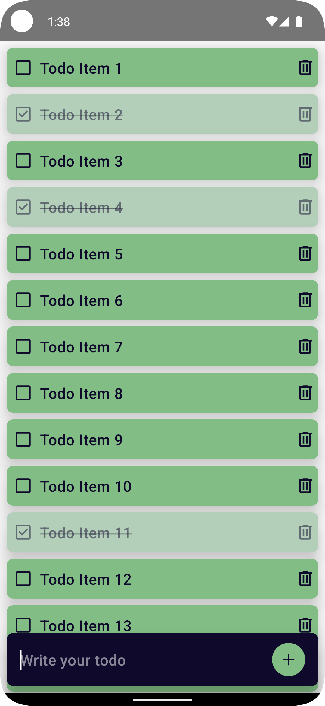

# TodoDemoApp

  

## Medium Article

This project is accompanied by a comprehensive Medium article that details the process of integrating UI Tests into a Todo App using Android Compose. You can read the article [here]().

## Overview

TodoDemoApp is an Android application developed with Jetpack Compose and Room Database. This app demonstrates an advanced approach to Android app development, extending beyond basic UI implementation and dynamic data storage and retrieval. It's an excellent resource for developers looking to understand the integration of Compose's interactive UI with Room Database's robust data management, along with a comprehensive introduction to UI testing in Android.

Key aspects of the project include:

- Integration of Room Database for Persistent Data Storage: The app uses Room Database to ensure robust data persistence, which is crucial for maintaining app state during unexpected closures and system interruptions.
- Implementation of ViewModel: The ViewModel is used to manage UI-related data in a lifecycle-conscious way, ensuring data persistence across configuration changes.
- Usage of Kotlin Coroutines Flow: Kotlin coroutines Flow is employed for efficient and responsive database operations, making the app reactive and user-friendly.
- Comprehensive UI Testing with Android Compose: The app includes detailed implementation of UI tests using Android Compose. This section provides a step-by-step guide on how to write and run UI tests, ensuring the app's functionality and reliability. It covers various testing scenarios like adding, toggling, and deleting todo items, dealing with todo lists and dynamic content.
- Strategic Use of Test Tags and Content Descriptions in Compose: The project demonstrates the use of test tags and content descriptions within Compose to identify and interact with UI components in a testing environment.

## Getting Started

1. Clone the repository to your local machine.
2. Open the project in Android Studio (preferably the latest version for full Compose support).
3. Run the app on an emulator or physical device to see the app in action.
